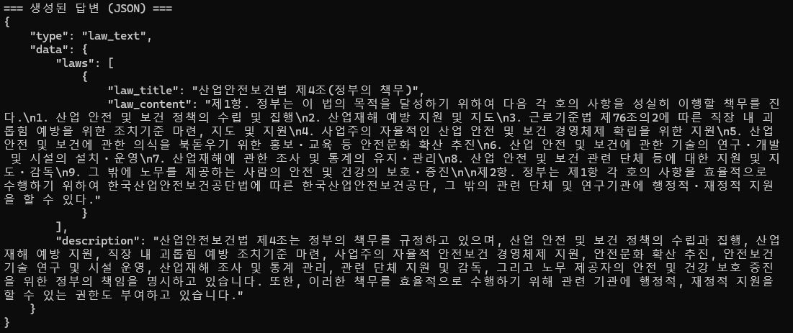
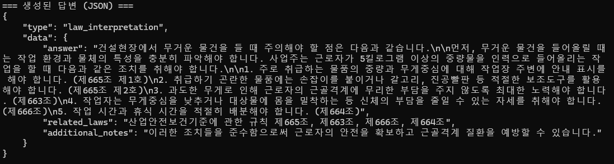
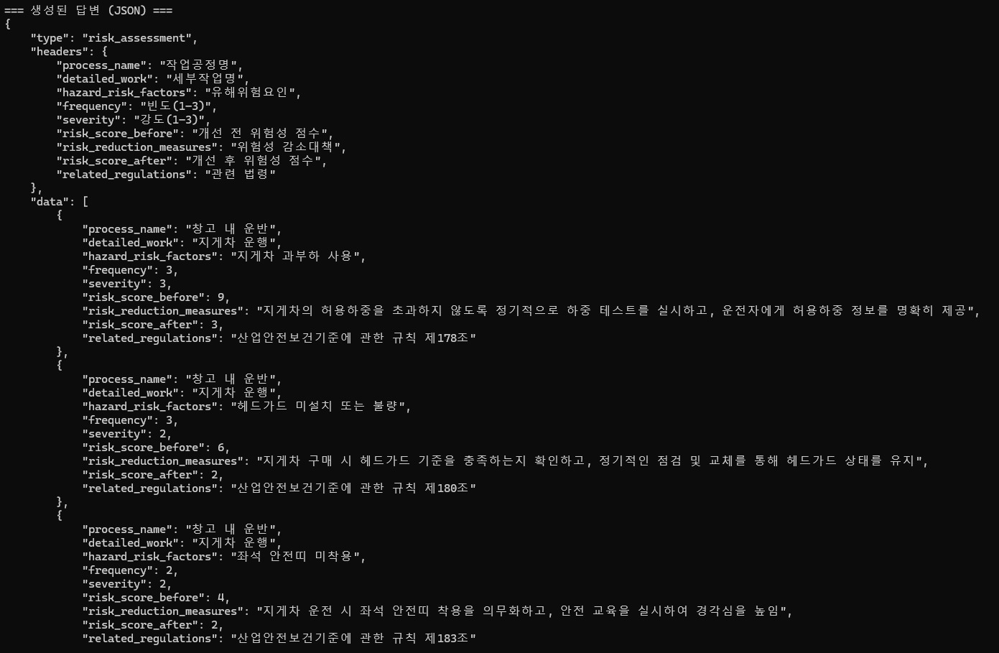
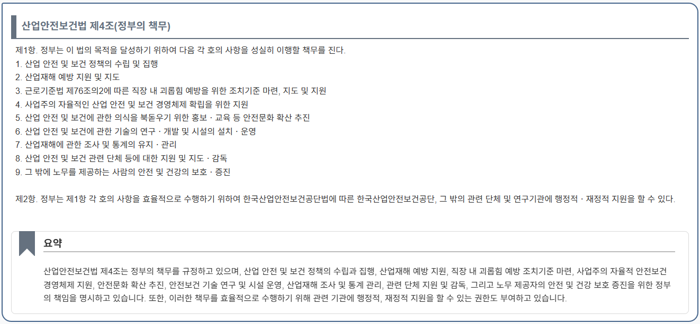
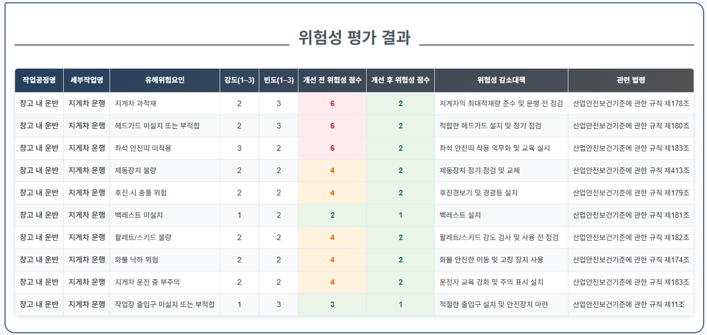

# RAG 기반 법령 및 위험성평가 자동화 챗봇

**본 프로젝트는 `위솔루션 2025년 여름방학 현장실습`의 일환으로 진행되었습니다.**

[](https://www.python.org/)
[](https://huggingface.co/)

## 🌟 프로젝트 소개

산업안전보건 분야의 **법령 질의응답**과 **KRAS 3x3 위험성평가**를 자동화하는 RAG(검색 증강 생성) 기반 챗봇 시스템입니다. 복잡한 법규와 평가 절차에 대한 사용자의 접근성을 높이고, 신뢰도 높은 정보를 기반으로 정확한 답변을 제공하는 것을 목표로 합니다.

## ✨ 핵심 기능

* **법령 질의응답**: 사용자의 질문 의도를 파악하여 관련 법령 조문을 정확히 검색하고, 이를 기반으로 상세한 해석 및 설명을 제공합니다.
* **위험성평가 자동화**: 특정 작업에 대한 유해위험요인과 감소대책을 RAG를 통해 도출하고, KRAS(3x3) 방법론에 기반한 위험성 점수 계산까지 자동으로 수행합니다.
* **LLM 기반 유효성 검증**: 규칙 및 LLM 기반의 이중 필터링으로 의미 없는 질문을 사전에 차단하여 시스템 안정성과 답변 품질을 확보합니다.

## 🚀 작동 원리 (Architecture)

챗봇은 사용자의 질문을 받아 유형을 분류하고, 각 유형에 맞는 특화된 파이프라인을 통해 답변을 생성합니다.

**[사용자 입력] ➔ [1. 유효성 검증] ➔ [2. 질의 유형 분류] ➔ [3A. 법령 질문 파이프라인 / 3B. 위험성평가 파이프라인]**

---

### **3A. 일반 법령 질문 처리 파이프라인**

단순 법령 검색을 넘어, 사용자의 의도를 **`법령 텍스트(law_text)`** 와 **`법령 해석(law_interpretation)`** 으로 구분하여 최적의 답변을 생성합니다.

1.  **RAG 검색**: 질문과 가장 유사한 법령 조항들을 벡터 DB에서 검색합니다.
2.  **LLM 답변 생성**: 검색된 법령을 근거로 사용자의 의도에 맞춰 답변을 생성하고, 관련 법령 목록과 함께 구조화된 JSON 형태로 반환합니다.




---

### **3B. 위험성 평가 처리 파이프라인**

복잡한 위험성평가 과정을 **다단계 RAG (Multi-Step RAG)** 와 **정량적 평가 자동화**로 해결합니다.

#### Ⅰ. 다단계 RAG를 통한 심층 분석

1.  **키워드 추출**: LLM이 질문에서 **'작업공정'** 과 **'세부작업'** 핵심 키워드를 추출합니다.
2.  **1차 RAG (컨텍스트 검색)**: 키워드를 기반으로 위험성평가에 필요한 광범위한 법령 정보를 검색합니다.
3.  **LLM 추론**: 검색된 법령을 참고하여 **유해위험요인**과 **감소대책**을 생성합니다.
4.  **2차 RAG (정밀 근거 매칭)**: 생성된 **각각의 감소대책**에 대해, 타당성을 뒷받침할 가장 정확한 단일 법 조항을 다시 검색하여 **1:1로 매칭**합니다. 이를 통해 모든 제안의 신뢰성을 극대화합니다.

#### Ⅱ. 자동 위험성 평가 및 정량화

1.  **위험성 평가**: KRAS(3x3 Matrix) 방법론에 따라 각 위험요인의 **빈도(Likelihood)**와 **강도(Severity)**를 LLM이 자동으로 평가합니다.
2.  **위험성 점수 계산**: 개선 전/후 위험성 점수를 계산하여 제안된 감소대책의 실효성을 수치로 명확하게 제시합니다.
3.  **최종 결과 생성**: 모든 정보를 종합하여 최종 위험성평가 테이블을 생성하고, 구조화된 JSON 형태로 반환합니다.



---

## 🌐 웹 통합 및 API 엔드포인트
integrated_server.py는 RAG 챗봇 시스템을 웹에서 직접 사용할 수 있도록 해주는 통합 서버 파일입니다. Flask를 기반으로 구축되었으며, 오디오 처리 기능까지 포함하여 사용자가 웹 인터페이스를 통해 텍스트 및 음성으로 AI와 소통하고 그 결과를 시각화할 수 있도록 지원합니다.

**/chat:** 텍스트 기반 질의응답을 위한 엔드포인트. 사용자 메시지를 받아 RAG 챗봇 로직을 실행하고 결과를 반환합니다.

**/voice:** 음성 기반 질의응답을 위한 엔드포인트. 사용자의 오디오 파일을 입력받아 Whisper 모델로 텍스트를 추출한 후, RAG 챗봇 로직을 실행하여 답변을 제공합니다.





## 🛠️ 기술 스택

* **Backend**: Python, `llama-cpp-python`
* **LLM**: `SKT A.X 4.0 Light (GGUF)`
* **Embedding**: `dragonkue/snowflake-arctic-embed-l-v2.0-ko`
* **RAG**: 자체 구축 로컬 RAG

## 💾 데이터 준비 및 RAG 구성
이 프로젝트는 효과적인 RAG를 위해 사전에 법령 데이터를 처리하고 벡터화하는 과정을 거칩니다.

**데이터 처리 및 청크 생성**: 법령 원본 텍스트 파일들을 파싱하여, RAG 검색에 용이한 형태로 분할(청크)하고 .pkl 파일로 저장합니다. 이 파일들은 각 법령의 텍스트와 메타데이터를 담고 있습니다.

**임베딩 및 인덱싱**: snowflake-arctic-embed 모델을 사용하여 .pkl 파일의 텍스트 청크를 고차원 벡터로 변환합니다. 이후 faiss 라이브러리를 활용하여 이 벡터들을 빠르게 검색할 수 있는 효율적인 인덱스(law_index*.faiss 파일)를 구축합니다.


## 📂 프로젝트 구조
```
├── models/
│   └── A.X-4.0-Light-Q4_K_M.gguf
│   └── snowflake-arctic-embed-l-v2.0-ko
├── data/
│   └── 산업안전보건기준에관한규칙.pkl
│   └── 산업안전보건법.pkl
│   └── 항만법.pkl
│   └── 해운법.pkl
│   └── 중대재해처벌법.pkl
│   └── 산업안전보건법시행령.pkl
│   └── law_index1.faiss
│   └── law_index2.faiss
│   └── law_index3.faiss
│   └── law_index4.faiss
│   └── law_index5.faiss
│   └── law_index6.faiss
├── main.py                # 챗봇 메인 실행 파일, 질의 유형 분류
├── risk_assessment.py     # 위험성평가 파이프라인 모듈
├── general_questions.py   # 일반 법령 질문 파이프라인 모듈
├── retrieve.py            # RAG 벡터 검색 모듈
└── requirements.txt
```

## ⚙️ 설치 및 실행 방법

### 1. 모델 다운로드

* **LLM (SKT A.X-4.0-Light)**
    * [Mungert/A.X-4.0-Light-GGUF](https://huggingface.co/Mungert/A.X-4.0-Light-GGUF)에서 `A.X-4.0-Light-Q4_K_M.gguf` 파일을 다운로드하여 `models/` 폴더에 저장합니다.
* **Embedding (Ko-Arctic-Embed)**
    * [dragonkue/snowflake-arctic-embed-l-v2.0-ko](https://huggingface.co/dragonkue/snowflake-arctic-embed-l-v2.0-ko) 모델을 다운로드하여 프로젝트 폴더에 저장합니다.

### 2. 의존성 설치
pip install -r requirements.txt

## 💡 향후 개선 방향

**점수 평가 객관성 강화**: 위험성 평가의 빈도·강도 점수 평가 로직 정교화

**멀티모달 기능 도입**: 이미지나 도면을 활용한 위험성평가 기능 추가
